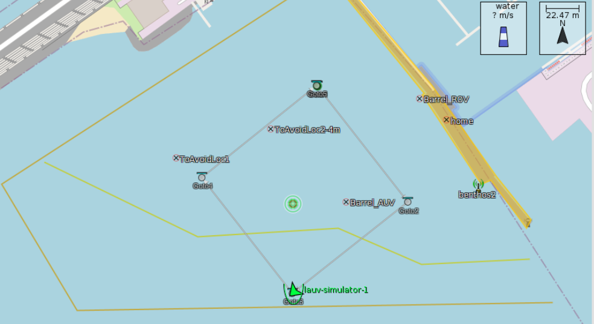
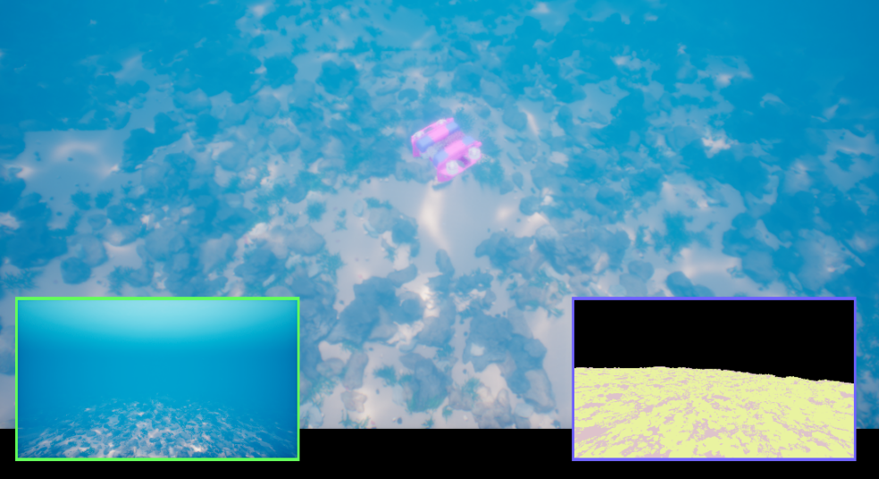

# Revolutionizing Pipeline Inspection with Autonomous Underwater Vehicles

Imagine a world where underwater infrastructure is maintained with minimal human intervention, reducing costs and increasing efficiency. This is becoming a reality with the advent of Autonomous Underwater Vehicles (AUVs), which are changing how we inspect and maintain underwater pipelines.

## The Challenge of Underwater Pipeline Inspection

Underwater pipelines are indispensable in many industries, especially oil and gas. Ensuring their integrity is vital to prevent environmental disasters and maintain smooth operations. Traditionally, this task has been carried out using Remotely Operated Vehicles (ROVs). While effective, ROVs are costly, labor-intensive, and require a team of operators.

## Enter the Age of Autonomy

Our latest research introduces an innovative framework that leverages Behavior Trees (BTs) to enhance the autonomy of AUVs for pipeline inspection. This approach reduces human involvement and ensures more efficient and accurate inspections.

### How Does It Work?
1. **Behavior Trees for Mission Planning**: We use Behavior Trees to design flexible and adaptive mission plans. These behavior trees allow the AUV to react to the dynamic underwater environment in real-time, ensuring it can handle unexpected events seamlessly.
2. **Safety First with BehaVerify**: Our framework includes BehaVerify, a tool that verifies the safety of mission plans. This step is essential as it generates the initial implementation code, ensuring that the AUV operates safely, even without direct human oversight.
3. **Realistic Simulations**: We test our mission plans in a simulated environment using the UNavSim simulator before deploying in the real world. This step ensures that our plans are robust and reliable.

    

### The Autonomous Pipeline Inspection Algorithm

At the heart of our approach is a sophisticated deep-learning model trained on Side-Scan Sonar (SSS) images. This model allows the AUV to detect and follow pipelines autonomously. The algorithm switches between three core maneuvers:

    

1. **Rows Maneuver**: Scans large areas to detect the pipelines.
2. **GoTo Maneuver**: Guides the AUV to the detected pipeline coordinates.
3. **Tracking Maneuver**: Follows the pipeline while maintaining an optimal distance.

  
  &nbsp;&nbsp;&nbsp;&nbsp;&nbsp;
  

If the pipeline is lost, the AUV initiates a search maneuver to find it again, ensuring continuous inspection.

## Ensuring Safe and Successful Missions

Autonomous operations introduce new challenges in ensuring safety without human intervention. Our framework addresses this by embedding safety checks within the Behavior Trees, such as monitoring battery levels and avoiding restricted zones. Model-checking techniques verify these safety properties, ensuring that the AUV remains in a safe mode if any issues arise.

## Real-World Impact

We tested our framework in simulated environments, and the results are promising. Our autonomous system performed real-time pipeline inspections efficiently and accurately.

Those interested in diving deeper into our research can access our algorithm and detailed implementation on our [GitHub repository](https://github.com/remaro-network/pipe_inspection_mission).
