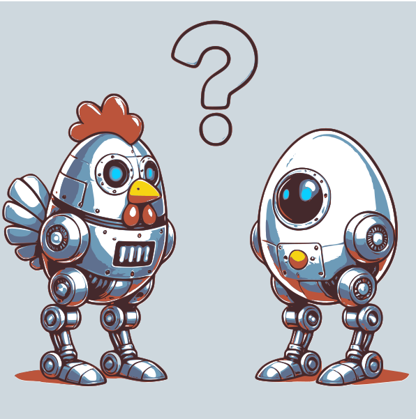

# Monocular visual Simultaneous Localization and Mapping (SLAM): formulation and surveying

This blog post is based on the paper:

>Álvarez-Tuñón, O., Brodskiy, Y., & Kayacan, E. (2023). Monocular visual simultaneous localization and mapping:(r) evolution from geometry to deep learning-based pipelines. IEEE Transactions on Artificial Intelligence.

## What is SLAM?

SLAM, or Simultaneous Localization and Mapping, is a fundamental method enabling autonomous navigation in mobile robots. It addresses two critical questions:
- *Where am I (within the environment)?*
- *What does the environment around me look like?*

You may have noticed that to determine your location (where am I?), you first need to understand your surroundings (what does the environment around me look like?). Conversely, to map the environment, you must know your position within it. That is commonly known as *the chicken and egg problem* in SLAM.

Formally speaking, *"SLAM defines  a state estimation problem in which an autonomous system must determine its location in the environment while generating a representation of it as a map"*.

If you own a cleaning robot that knows how to return to its charging station, it likely uses a SLAM system. As it moves around your rooms, it creates a map of your house's layout. Each time you run it, the robot updates this map, allowing it to locate itself within your home and navigate back to the charging point efficiently.

The SLAM methods come with a variety of flavours depending on the sensor(s) you're using, which in turn depends on the environment you're deploying or the budged you have for your robot.
This blog post will introduce and survey visual SLAM, a SLAM approach based on using camera sensors. Visual SLAM offers several advantages:
- Low Cost: Camera sensors are generally inexpensive compared to other types of sensors.
- Rich Information: Cameras can capture detailed and complex features of the environment.
- Versatility: Camera sensors can be used in various environments and applications, providing flexibility in SLAM implementation.

## The SLAM vocabulary

SLAM is a complex method, and many different approaches have been developed to solve it. This has led to a very wide terminology to define all the different SLAM taxonomies, as well as the algorithms that comprise it. This vocabulary can be intricate for the researcher new to the subject, and it was certainly complicated for me in my early days. The motivation of this blog post, and the paper that it's based on, is to help you get introduced to this new vocabulary.

First of all, we can divide SLAM in two modules: the *front-end* and the *back-end*. In short:
- The front-end infers estimates from the sensors. 
- The back-end optimizes the estimates from the front-end.
  
#### The SLAM front-end

The SLAM front-end consists of all the algorithms that infer some estimate from the (camera) sensor data. These algorithms are essential for processing raw sensor inputs into meaningful information that can be used for localization and mapping. The primary components of the SLAM front-end are:
- *Tracking* is the process of continuously estimating the robot's position and orientation (*pose*) relative to its surroundings. It is also referred to as *visual odometry*.
- *Loop detection*, also known as loop closure, is the process of recognizing previously visited locations to correct accumulated errors in the map and the robot's pose estimate. *Relocalization* is closely related and refers to the ability of the system to recover from tracking failures by identifying known locations. 

### Tracking or Visual Odometry

|                    |            Keypoints           |     Gradient Pixels    |     All Pixels    |
|-------------------:|:------------------------------:|:----------------------:|:-----------------:|
| Reprojection error | Indirect or feature-based SLAM |           N/A          |        N/A        |
|  Photometric error |       Sparse direct SLAM       | Semi-dense direct SLAM | Dense direct SLAM |