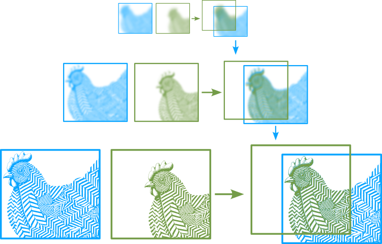
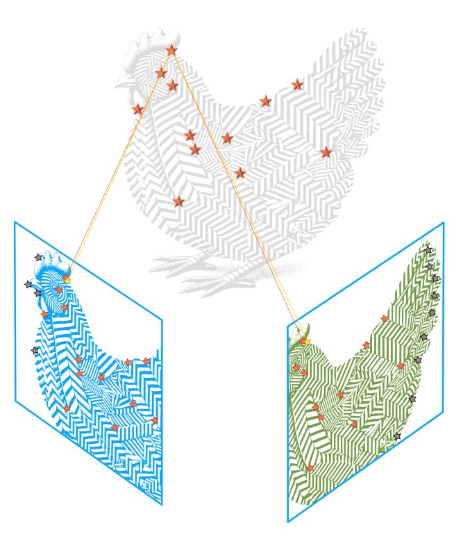
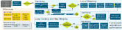

# Monocular visual Simultaneous Localization and Mapping (SLAM): formulation and surveying

This blog post is based on the paper:

>Álvarez-Tuñón, O., Brodskiy, Y., & Kayacan, E. (2023). Monocular visual simultaneous localization and mapping:(r) evolution from geometry to deep learning-based pipelines. IEEE Transactions on Artificial Intelligence.

- [Monocular visual Simultaneous Localization and Mapping (SLAM): formulation and surveying](#monocular-visual-simultaneous-localization-and-mapping-slam-formulation-and-surveying)
  - [What is SLAM?](#what-is-slam)
  - [The SLAM vocabulary](#the-slam-vocabulary)
    - [The SLAM front-end](#the-slam-front-end)
      - [Tracking or Visual Odometry](#tracking-or-visual-odometry)
    - [The SLAM back-end](#the-slam-back-end)

## What is SLAM?

SLAM, or Simultaneous Localization and Mapping, is a fundamental method enabling autonomous navigation in mobile robots. It addresses two critical questions:
- *Where am I (within the environment)?*
- *What does the environment around me look like?*

You may have noticed that to determine your location (where am I?), you first need to understand your surroundings (what does the environment around me look like?). Conversely, to map the environment, you must know your position within it. That is commonly known as *the chicken and egg problem* in SLAM.

Formally speaking, *"SLAM defines  a state estimation problem in which an autonomous system must determine its location in the environment while generating a representation of it as a map"*.

If you own a cleaning robot that knows how to return to its charging station, it likely uses a SLAM system. As it moves around your rooms, it creates a map of your house's layout. Each time you run it, the robot updates this map, allowing it to locate itself within your home and navigate back to the charging point efficiently.

The SLAM methods come with a variety of flavours depending on the sensor(s) you're using, which in turn depends on the environment you're deploying or the budged you have for your robot.
This blog post will introduce and survey visual SLAM, a SLAM approach based on using camera sensors. Visual SLAM offers several advantages:
- Low Cost: Camera sensors are generally inexpensive compared to other types of sensors.
- Rich Information: Cameras can capture detailed and complex features of the environment.
- Versatility: Camera sensors can be used in various environments and applications, providing flexibility in SLAM implementation.

## The SLAM vocabulary

SLAM is a complex method, and many different approaches have been developed to solve it. This has led to a very wide terminology to define all the different SLAM taxonomies, as well as the algorithms that comprise it. This vocabulary can be intricate for the researcher new to the subject, and it was certainly complicated for me in my early days. The motivation of this blog post, and the paper that it's based on, is to help you get introduced to this new vocabulary.

First of all, we can divide SLAM in two modules: the *front-end* and the *back-end*. In short:
- The front-end infers estimates from the sensors. 
- The back-end optimizes the estimates from the front-end.
  
### The SLAM front-end

The SLAM front-end consists of all the algorithms that infer some estimate from the (camera) sensor data. These algorithms are essential for processing raw sensor inputs into meaningful information that can be used for localization and mapping. The primary components of the SLAM front-end are:
- *Tracking* is the process of continuously estimating the robot's position and orientation (*pose*) relative to its surroundings. It is also referred to as *visual odometry*.
- *Loop detection*, also known as loop closure, is the process of recognizing previously visited locations to correct accumulated errors in the map and the robot's pose estimate. *Relocalization* is closely related and refers to the ability of the system to recover from tracking failures by identifying known locations. 

#### Tracking or Visual Odometry

While the overall objective of SLAM is to estimate a globally consistent camera trajectory within a map, the tracking thread incrementally obtains an estimate of the local trajectory. This process, often referred to as Visual Odometry (VO), involves calculating the camera's motion by analyzing changes in the captured images over time. Depending on how motion is estimated from adjacent image frames, we can classify the methods for visual tracking as *direct* or *indirect*:

- Direct methods estimate the motion from the intensity information of the pixels in the image. The estimate is obtained by optimizing the photometric error. Depending on the pixels selected for the optimization, direct methods can be classified as:
  - *Sparse*, if only sparse keypoints are considered,
  - *Semi-dense*, if all pixels with high gradients are included, or
  - *Dense* if all pixels are included.
  

 
  > Direct methods compare the pixel intensities between consecutive image frames and align the images by minimizing the photometric error. This optimization is highly nonconvex, and thus is performed following a coarse-to-fine approach, matching at low resolutions first and then iteratively refining at higher resolutions.

- Indirect methods, also known as *feature-based* methods, rely on extracting and matching features or keypoints between frames to estimate motion. This computation is based on the optimization of the reprojection error.

> Given a set of matched features  (in this case, taking only one as example), a camera transform is estimated. This transform is used to project the points in the 3D space, which are then reprojected back on the image. This reprojection error is used to refine the camera transform estimate.

An example of a widely-used indirect method is ORB-SLAM3:

In short, SLAM algorithms are often named after the error function that is being optimized and the kind of information (pixels/Keypoints) that is used in such optimization:

|                    |            Keypoints           |     Gradient Pixels    |     All Pixels    |
|-------------------:|:------------------------------:|:----------------------:|:-----------------:|
| Reprojection error | Indirect or feature-based SLAM |           N/A          |        N/A        |
|  Photometric error |       Sparse direct SLAM       | Semi-dense direct SLAM | Dense direct SLAM |

### The SLAM back-end
By itself, the front-end will drift as the time pases and the map increases. The back-end optizes the estimates from the front-end. It does so by creating a *map* of previous  estimates and measurements. 

> A chicken creating a map that stores previous points in the trajectory. The so-called keyframes are conditioned by the chicken's stepsize.

According to how the map is structured
and processed, there are two approaches: *filter-based* and
*optimization-based*:
- Filter-based  marginalise all the poses for every new
frame while retaining all the landmarks detected, creating a
compact graph. This graph only grows when exploring new areas and detecting new features. However, it will eventually become a fully interconnected graph, severely limiting the number of features that can be stored while preserving computational efficiency.

- Optimization-based approaches, as opposed to filtering, solve
the complete graph, leveraging an algorithm such as bundle adjustment (BA). They can either do it in a sliding window (local BA), or in a subset of the overall frames, referred to as keyframes (global BA). The rate at which the optimization is performed is lower than the frame rate: despite including more elements in the computation, they are sparsely connected, making optimization approaches comparatively more efficient. Furthermore, it has been argued that adding features is more beneficial for accuracy than adding frames [76]. All these facts have turned optimization approaches into the new de facto standard for the back-end in SLAM. 