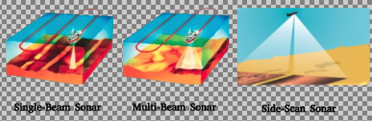
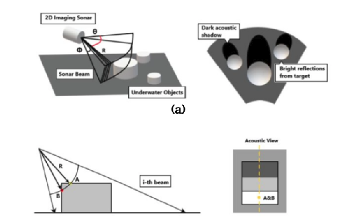
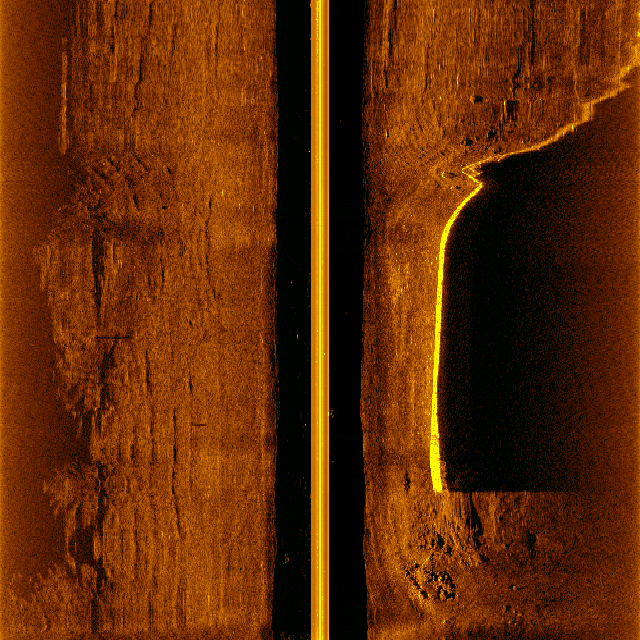
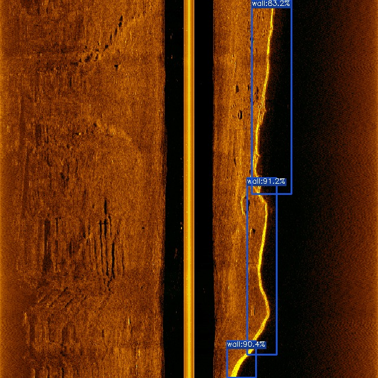
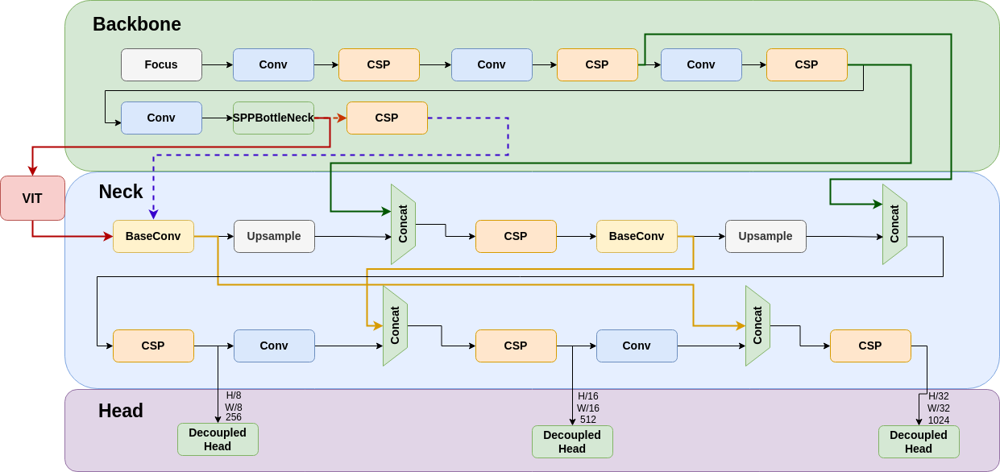
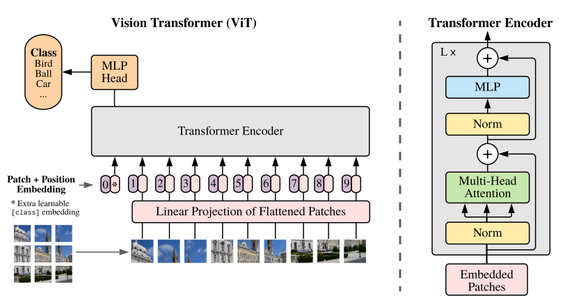
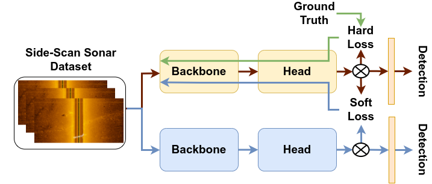
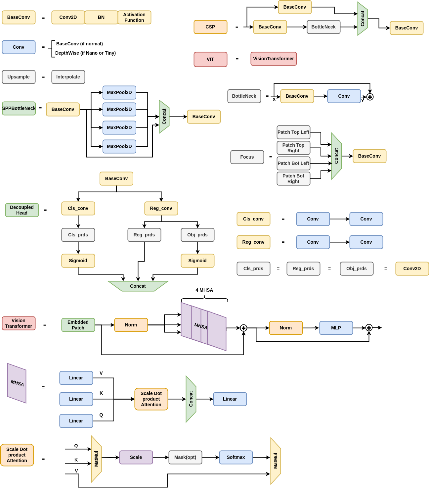

# Sonars Introduction

Sonars are acoustic sensors that rely on the propagation of sound to navigate or detect objects in the underwater domain. High-resolution sonars typically operate by emitting sound pulses at a high frequency, which allows for short-range scanning. Conversely, using lower frequencies extends the scanning range but decreases the resolution. By receiving and processing the signals that bounce back from encountered objects, sonars can detect the range of these objects.

There are different kinds of sonars used for various applications, categorized into two main groups: active and passive. Active sonars emit sound pulses and listen for their return, while passive sonars only listen to sounds emitted by other sources (e.g., other ships or marine life). This makes passive sonars suitable for specific applications such as submarine detection and marine-life monitoring, while active sonars can be used for broader purposes including underwater navigation, object detection, and seafloor mapping.

<!--  -->

<figure>
  
   
 Figure 1: Visualization of Single Beam echo-sounder, Multi Beam echo-sounder, and Side Scan Sonar.

</figure> 

Active sonars are characterized by a set of main features: frequency, number of beams, minimum and maximum ranges, and horizontal and vertical apertures. Variations in these characteristics result in different sonar designs. The most well-known ones include Single-Beam sonars, Multi-Beam sonars, Forward-Looking sonars (FLS), Side-Scan sonars (SSS), and Synthetic Aperture sonars (SAS). Single-Beam sonars have one beam with a 1-degree vertical and horizontal aperture, typically used for measuring water depth. Multi-Beam sonars, while maintaining a single degree of vertical aperture, have a wide horizontal aperture that emits multiple beams in a fan-shaped pattern, making them ideal for seafloor mapping. Forward-Looking sonars have wide horizontal and vertical apertures, providing a higher level of detail from scanned environments. The output of FLS is a 2D image representing the range (distance to objects) and the beam angle, which helps visualize fine features, though 3D reconstruction using them is challenging.

SSS consists of two identical sonars scanning from both sides, each with a narrow horizontal aperture, wide vertical aperture, and high maximum scanning range. Mounted on a moving platform, SSS is used for seabed imaging, providing a high level of detail. SAS are advanced SSS that ping sound pulses at a higher rate while covering long ranges. SAS outputs are images with much higher resolution than conventional sonars, allowing for detailed examination of small objects and fine features. However, their use is limited by the strict requirement of maintaining stable movements throughout the scan.

<!--  -->

<figure>
  
   
 Figure 2: Visualization of the principle of Forward-Looking Sonar.

</figure> 

Researchers working on underwater perception have faced challenges when using specific sonar devices for applications beyond their hardware capabilities. One such challenge is using FLS for 3D reconstruction purposes. Figure 2 (a and b) illustrates how FLS emits its fan-shaped beams, the data retrieved, and the acoustic 2D representation of scanned objects. As shown in Figure 2(a), the range \(R\) is detected to determine how far the objects are, and the beam number represented by angle \(\theta\) is known. However, the vertical angle, also known as the elevation angle, is lost. Another challenge in using FLS is shown in Figure 2(b), where at a specific beam \(i\), a ray hitting an object at several points over the same radius \(R\) is represented by the same point in an acoustic image, albeit with a higher intensity. This means that several points in the actual 3D world are only represented by one point in the acoustic image.

# Towards Robust and Efficient Side-scan Sonar Object Detection with YOLOX-ViT

## Outline

<!-- - Why AUV for data underwater data collection
- Why SSS? -->
<!-- - why object detection?
- Basic introduction of object detection and object detection on sonar images
- What are the limitations of object detection for SSS images
- current main limitations, why do we introduce our work (why KD, why adversarial attacks)
- we describe what we want to achieve in both parts -->

Side-scan sonar (SSS), one of the most used type of sonar, emits sound waves towards the sea floor and captures the returning echoes, creating detailed, high-resolution images (see Figure 1) of underwater landscapes. This technology is precious for detecting and identifying submerged objects, mapping the sea floor, and conducting environmental assessments. The detailed imagery produced by SSS makes it an indispensable tool in underwater exploration and research. However, the large volume of data generated by SSS necessitates automated processing techniques, where object detection algorithms come into play.

<figure>
  
   
 Figure 3: An example of Side-scan sonar image with a wall on the right (yellow curve). The black area with the yellow line in the middle of the image is the so-called Nadir gap. The Nadir gap is the area which is out of the field-of-view of the two side-scan sonar.

</figure> 

Object detection (see Figure 2) is a fundamental task in computer vision, aiming to locate and classify objects within an image. However, applying object detection to sonar images poses unique challenges due to the distinct characteristics of sonar imagery, such as noise, low contrast, and complex underwater features.

<figure>
  
   
 Figure 4: An example of the output of an object detection model. The blue boxes show the predicted bounding boxes of a model, including an object class (in this case wall) and confidence score, expressed as a percentage.

</figure> 

 
Despite the advancements in object detection algorithms, there are significant limitations when applied to SSS images. Current models often need help with the variability and quality of sonar data, leading to suboptimal performance. Additionally, traditional object detection models are computationally intensive, which can be a bottleneck for real-time applications on resource-constrained AUVs.

We introduce our work on robust and efficient side-scan sonar object detection using YOLOX-ViT to address these challenges. Our approach leverages knowledge distillation (KD) and adversarial training to enhance the model's efficiency and robustness. Knowledge distillation allows us to transfer knowledge from a larger, more complex model to a smaller, more efficient one, improving performance without compromising speed. Conversely, adversarial training strengthens the model against potential adversarial attacks, ensuring reliable operation in diverse underwater conditions.

The primary aim of our work is to enable onboard object detection, allowing the AUV to process SSS images in real time. This onboard processing leverages the efficiency and reliability of our detection model, enabling the vehicle to modify its behavior based on the detected objects. Such capability is crucial for adaptive missions, where the AUV can make informed decisions autonomously, enhancing the overall mission success rate.

In this work, we aim to achieve two main objectives: improving the accuracy and efficiency of object detection in SSS images and enhancing the robustnes of the detections. By addressing these goals, we contribute to advancing the state-of-the-art in underwater object detection, facilitating more effective and reliable underwater exploration and monitoring.

## Knowledge Distillation in YOLOX-ViT for Side-Scan Sonar Object Detection

This part of the blog post is based on the [paper](https://arxiv.org/abs/2403.09313):

>Aubard, M., Antal, L., Madureira, A., & Ábrahám, E. (2024). Knowledge Distillation in YOLOX-ViT for Side-Scan Sonar Object Detection. 
>ArXiv, abs/2403.09313.

### Introduction
Exploring the oceanic environment has become increasingly important due to various underwater activities such as infrastructure development and archaeological explorations. Autonomous underwater vehicles (AUVs) play a crucial role in these tasks, enabling efficient data collection and underwater operations. However, the complex nature of underwater environments demands advanced decision-making capabilities and high situational awareness.

In this context, deep learning (DL) based computer vision offers a promising solution for real-time detection. Yet, the large size of standard DL models poses challenges for AUVs concerning power consumption, memory allocation, and real-time processing needs. This paper introduces YOLOX-ViT, an advanced object detection model incorporating a vision transformer layer and utilizing knowledge distillation to reduce model size without sacrificing performance.

### YOLOX-ViT Model

<figure>
  
   
 Figure 5: Model architecture of YOLOX-ViT. Further explanation of each block can be found in Figure 6 and 8.

</figure>

YOLOX-ViT (see Figure 5) enhances the YOLOX model by integrating a vision transformer layer (ViT) between the backbone and neck, significantly improving feature extraction capabilities. The ViT layer is configured with 4 multi-head self-attention (MHSA) sub-layers, combining the spatial hierarchy of CNNs with the global context of transformers. This integration enhances the model's ability to detect objects in complex underwater environments.

<figure>
  
   
 Figure 6: Illustration of the composition of the vision transformer layer (ViT). 

</figure>

### Knowledge Distillation
Knowledge distillation (KD) is employed to transfer knowledge from a larger, well-trained model (teacher) to a smaller model (student), using a combined loss function that incorporates both hard and soft loss components (this is visualized on Figure 7). This process allows the smaller model to learn from the nuanced behaviors of the larger model, improving its performance while maintaining a reduced size. Formally, the loss function can be expressed as:

$$
\large \mathcal{L} = \lambda_{\text{hard}}\mathcal{L}_{\text{hard}} + \lambda_{\text{soft}}\mathcal{L}_{\text{soft}}
$$

The KD process in YOLOX-ViT involves computing distinct loss functions for each output of the feature pyramid network (FPN), ensuring a comprehensive transfer of knowledge across classification, bounding box regression, and objectness scores. Both online and offline KD methods are explored, with the offline method reducing training time significantly. For further information, we refer to the paper mentioned above. 

Using knowledge distillation, YOLOX-ViT-Nano learns directly from the logits of a pre-trained YOLOX-ViT-L model. This approach has shown a notable reduction in false positive detections by **20.35%**.

<figure>
  
   
Figure 7: Visualization the knowledge distillation process in YOLOX-ViT.

</figure>

### Large vs. Small Models
The lack of dedicated computing resources such as GPUs is a common hindrance in deploying computer vision models in production. Large models require dedicated hardware to run in real time, while small models, though faster, suffer from reduced accuracy. Knowledge distillation allows small models to learn from larger ones, improving their accuracy while maintaining efficiency for real-time deployment on CPUs.

### Sonar Wall Detection Dataset (SWDD)
For conductiong experiments, we introduce a new side-scan sonar (SSS) image dataset, the Sonar Wall Detection Dataset (SWDD). Collected in Porto de Leixões harbor using a Klein 3500 sonar on a light autonomous underwater vehicle (LAUV), the dataset includes 216 images along harbor walls. Data augmentation techniques such as noise addition, horizontal flips, and combined transformations are used to enhance the dataset's robustness.

SWDD is completely open-access and available online on Zenodo. Accessing is possible at the following [LINK](https://zenodo.org/records/10528135).

The dataset features two classes, "Wall" and "NoWall," with 2,616 labeled samples. The images are scaled to 640 × 640 for compatibility with computer vision algorithms, coupled with the detection labels in YOLOX and MS-COCO format.

### Experimental Evaluation
The experimental evaluation of YOLOX-ViT involves training and validating the model on real-world data, including a detailed video analysis. Metrics such as true positives (TP), false positives (FP), precision (Pr), average precision at 50% IoU (AP50), and overall average precision (AP) are used to assess performance. The results demonstrate the effectiveness of YOLOX-ViT and the KD approach in reducing false positives and improving detection accuracy in underwater environments.

### Conclusion
The integration of a visual transformer layer and the application of knowledge distillation in YOLOX-ViT provide a significant advancement in object detection for underwater robotics. The model achieves high accuracy with a reduced size, making it suitable for real-time implementation on AUVs. The introduced Sonar Wall Detection Dataset (SWDD) further supports research in this domain, offering valuable data for future studies.

The source code for knowledge distillation in YOLOX-ViT is available at [https://github.com/remaro-network/KD-YOLOX-ViT](https://github.com/remaro-network/KD-YOLOX-ViT).

### Additional Material

<figure>
  
  
Figure 8: Explanation of the building blocks of YOLOX-ViT.
  

</figure>

## Enhancing Model Robustness with Adversarial Examples

### Introduction
Ensuring the robustness of object detection models is paramount for safe and effective underwater robotic operations. Real-world scenarios often present challenges such as noise interference, occlusions, and varying environmental conditions, which can hinder the performance of computer vision systems. To address these challenges, we introduce a novel approach leveraging the alpha-beta-Crown tool to enhance the robustness of object detection models for side-scan sonar (SSS) imagery.

### The Need for Robust Object Detection
Autonomous underwater vehicles (AUVs) rely on accurate object detection capabilities to navigate, identify obstacles, and perform tasks efficiently in underwater environments. However, traditional models may struggle to maintain performance in the presence of noise or unexpected conditions, posing risks to mission success and equipment integrity.

### Introducing the Alpha-Beta-Crown Tool
The Alpha-Beta-Crown tool offers a systematic methodology to improve the robustness of object detection models. By generating specific safety properties, such as noise thresholds and bounding box criteria, the tool facilitates the identification of vulnerabilities in the model's predictions. This proactive approach enables us to address potential weaknesses before deployment, enhancing the model's reliability in real-world scenarios.

### Methodology
Our approach involves iteratively refining the model using counterexamples generated by the Alpha-Beta-Crown tool. When safety properties are violated, indicating potential vulnerabilities, the model is retrained using the last epoch weights as a starting point. This iterative process allows the model to learn from its mistakes and adapt to challenging conditions, thereby improving its robustness.

### Adversarial Attack Evaluation
To assess the effectiveness of the enhanced model, we subject it to adversarial attacks using Projected Gradient Descent (PGD) before and after the refinement process. Adversarial attacks simulate real-world scenarios by introducing perturbations or noise to the input data, evaluating the model's resilience against such disruptions. By comparing the model's performance pre- and post-refinement, we can quantify the improvement in robustness achieved through the Alpha-Beta-Crown methodology.

### Introducing Middle of Bounding Boxes Metric
In addition to traditional evaluation metrics, we introduce a novel metric that measures the distance between the ground truth middle of the bounding boxes and the inference middle. This metric provides insights into the alignment between predicted and actual object locations, offering a more comprehensive assessment of model performance.

### Leveraging Knowledge Distillation (KD)
Throughout the refinement process, we continue to leverage knowledge distillation (KD) to transfer knowledge from larger, well-trained models to the refined model. By distilling the insights and nuances of larger models into the refined model, we further enhance its performance and generalization capabilities.

### Leveraging Real-World Datasets
In addition to synthetic data generated by the alpha-beta-Crown tool, we utilize two noisy datasets from real-world environments. These datasets provide valuable insights into the challenges faced by object detection models in practical scenarios, enabling more comprehensive validation and refinement of our approach. The incorporation of real-world data ensures that our model remains effective in diverse and unpredictable conditions.

### Experimental Validation
Our experimental evaluation demonstrates the efficacy of the alpha-beta-Crown methodology in enhancing model robustness. By iteratively refining the model based on identified vulnerabilities and leveraging knowledge distillation, we observe significant improvements in detection performance, particularly in the presence of noise and adverse conditions. The refined model exhibits greater resilience against adversarial attacks and demonstrates improved alignment with ground truth bounding box locations.

### Conclusion
The integration of the alpha-beta-Crown tool offers a proactive approach to improving the robustness of object detection models for side-scan sonar imagery. By systematically identifying and addressing vulnerabilities, and incorporating novel evaluation metrics and knowledge distillation, we enhance the model's ability to maintain accurate detections in challenging underwater environments. This methodology represents a significant advancement in ensuring the reliability and safety of autonomous underwater vehicles, paving the way for more effective and secure underwater exploration and operations.

The source code for the alpha-beta-Crown tool, including the integration of adversarial attacks, novel evaluation metrics, and knowledge distillation, will be made available at [insert link here]. Stay tuned for updates and further advancements in underwater robotics and computer vision research.

