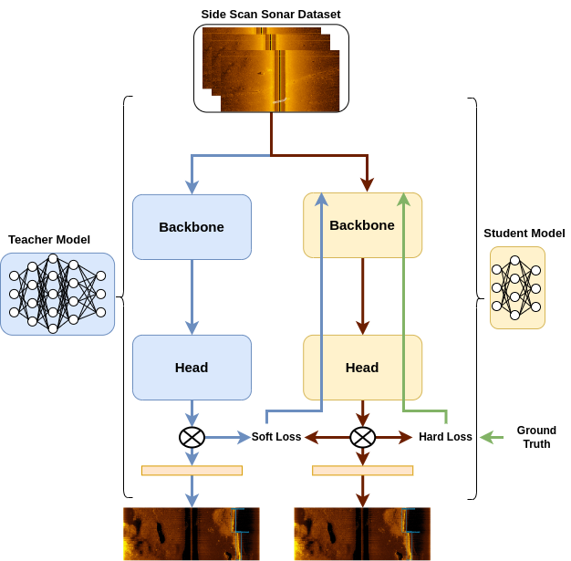

## Outline

## Knowledge Distillation in YOLOX-ViT for Side-Scan Sonar Object Detection

This blog post is based on the paper:

>Aubard, M., Antal, L., Madureira, A., & 'Abrah'am, E. (2024). Knowledge Distillation in YOLOX-ViT for Side-Scan Sonar Object Detection. 
>ArXiv, abs/2403.09313.

### Introduction
Exploring the oceanic environment has become increasingly important due to various underwater activities such as infrastructure development and archaeological explorations. Autonomous underwater vehicles (AUVs) play a crucial role in these tasks, enabling efficient data collection and underwater operations. However, the complex nature of underwater environments demands advanced decision-making capabilities and high situational awareness.

In this context, deep learning (DL) based computer vision offers a promising solution for real-time detection. Yet, the large size of standard DL models poses challenges for AUVs concerning power consumption, memory allocation, and real-time processing needs. This paper introduces YOLOX-ViT, an advanced object detection model incorporating a vision transformer layer and utilizing knowledge distillation to reduce model size without sacrificing performance.

### YOLOX-ViT Model

<figure>
  
   
 Figure 1: YOLOX-ViT Model Architecture. 

</figure>

YOLOX-ViT enhances the YOLOX model by integrating a vision transformer layer (ViT) between the backbone and neck, significantly improving feature extraction capabilities. The ViT layer is configured with 4 multi-head self-attention (MHSA) sub-layers, combining the spatial hierarchy of CNNs with the global context of transformers. This integration enhances the model's ability to detect objects in complex underwater environments.

<figure>
  
   
 Figure 2: Visual Transformer Layer. 

</figure>

### Knowledge Distillation
Knowledge distillation (KD) is employed to transfer knowledge from a larger, well-trained model (teacher) to a smaller model (student), using a combined loss function that incorporates both hard and soft loss components. This process allows the smaller model to learn from the nuanced behaviors of the larger model, improving its performance while maintaining a reduced size.

The KD process in YOLOX-ViT involves computing distinct loss functions for each output of the feature pyramid network (FPN), ensuring a comprehensive transfer of knowledge across classification, bounding box regression, and objectness scores. Both online and offline KD methods are explored, with the offline method reducing training time significantly. Using knowledge distillation, YOLOX-ViT-Nano learns directly from the logits of a pre-trained YOLOX-ViT-L model. This approach has shown a notable reduction in false positive detections by 20.35 points.

<figure>
  
   
Figure 3: Visualizating the Knowledge Distillation Process in YOLOX-ViT.

</figure>

### Large vs. Small Models
The lack of dedicated computing resources such as GPUs is a common hindrance in deploying computer vision models in production. Large models require dedicated hardware to run in real time, while small models, though faster, suffer from reduced accuracy. Knowledge distillation allows small models to learn from larger ones, improving their accuracy while maintaining efficiency for real-time deployment on CPUs.

### Sonar Wall Detection Dataset (SWDD)
A new side-scan sonar (SSS) image dataset, the Sonar Wall Detection Dataset (SWDD), is introduced. Collected in Porto de Leixões harbor using a Klein 3500 sonar on a light autonomous underwater vehicle (LAUV), the dataset includes 216 images along harbor walls. Data augmentation techniques such as noise addition, horizontal flips, and combined transformations are used to enhance the dataset's robustness.

The dataset features two classes, "Wall" and "NoWall," with 2,616 labeled samples. The images are scaled to 640 × 640 for compatibility with computer vision algorithms, and the dataset is publicly accessible for research purposes.

### Experimental Evaluation
The experimental evaluation of YOLOX-ViT involves training and validating the model on real-world data, including a detailed video analysis. Metrics such as true positives (TP), false positives (FP), precision (Pr), average precision at 50% IoU (AP50), and overall average precision (AP) are used to assess performance. The results demonstrate the effectiveness of YOLOX-ViT and the KD approach in reducing false positives and improving detection accuracy in underwater environments.

### Broader Implications and Limitations
The findings from this study have broader implications beyond underwater robotics, particularly in domains like autonomous land vehicles, medical imaging, and surveillance systems. However, potential drawbacks include increased training complexity, sensitivity to teacher model quality, and limited transferability across different datasets or tasks. Advancements in vision transformers also impact future developments in computer vision by enhancing feature extraction and global context understanding.

### Conclusion
The integration of a visual transformer layer and the application of knowledge distillation in YOLOX-ViT provide a significant advancement in object detection for underwater robotics. The model achieves high accuracy with a reduced size, making it suitable for real-time implementation on AUVs. The introduced Sonar Wall Detection Dataset (SWDD) further supports research in this domain, offering valuable data for future studies.

The source code for knowledge distillation in YOLOX-ViT is available at [https://github.com/remaro-network/KD-YOLOX-ViT](https://github.com/remaro-network/KD-YOLOX-ViT).

### Additional Material

<figure>
  
  
Figure 3: Architecture Block Explanations.
  

</figure>

## Enhancing Model Robustness with Adversarial Examples

### Introduction
Ensuring the robustness of object detection models is paramount for safe and effective underwater robotic operations. Real-world scenarios often present challenges such as noise interference, occlusions, and varying environmental conditions, which can hinder the performance of computer vision systems. To address these challenges, we introduce a novel approach leveraging the alpha-beta-Crown tool to enhance the robustness of object detection models for side-scan sonar (SSS) imagery.

### The Need for Robust Object Detection
Autonomous underwater vehicles (AUVs) rely on accurate object detection capabilities to navigate, identify obstacles, and perform tasks efficiently in underwater environments. However, traditional models may struggle to maintain performance in the presence of noise or unexpected conditions, posing risks to mission success and equipment integrity.

### Introducing the Alpha-Beta-Crown Tool
The Alpha-Beta-Crown tool offers a systematic methodology to improve the robustness of object detection models. By generating specific safety properties, such as noise thresholds and bounding box criteria, the tool facilitates the identification of vulnerabilities in the model's predictions. This proactive approach enables us to address potential weaknesses before deployment, enhancing the model's reliability in real-world scenarios.

### Methodology
Our approach involves iteratively refining the model using counterexamples generated by the Alpha-Beta-Crown tool. When safety properties are violated, indicating potential vulnerabilities, the model is retrained using the last epoch weights as a starting point. This iterative process allows the model to learn from its mistakes and adapt to challenging conditions, thereby improving its robustness.

### Adversarial Attack Evaluation
To assess the effectiveness of the enhanced model, we subject it to adversarial attacks using Projected Gradient Descent (PGD) before and after the refinement process. Adversarial attacks simulate real-world scenarios by introducing perturbations or noise to the input data, evaluating the model's resilience against such disruptions. By comparing the model's performance pre- and post-refinement, we can quantify the improvement in robustness achieved through the Alpha-Beta-Crown methodology.

### Introducing Middle of Bounding Boxes Metric
In addition to traditional evaluation metrics, we introduce a novel metric that measures the distance between the ground truth middle of the bounding boxes and the inference middle. This metric provides insights into the alignment between predicted and actual object locations, offering a more comprehensive assessment of model performance.

### Leveraging Knowledge Distillation (KD)
Throughout the refinement process, we continue to leverage knowledge distillation (KD) to transfer knowledge from larger, well-trained models to the refined model. By distilling the insights and nuances of larger models into the refined model, we further enhance its performance and generalization capabilities.

### Leveraging Real-World Datasets
In addition to synthetic data generated by the alpha-beta-Crown tool, we utilize two noisy datasets from real-world environments. These datasets provide valuable insights into the challenges faced by object detection models in practical scenarios, enabling more comprehensive validation and refinement of our approach. The incorporation of real-world data ensures that our model remains effective in diverse and unpredictable conditions.

### Experimental Validation
Our experimental evaluation demonstrates the efficacy of the alpha-beta-Crown methodology in enhancing model robustness. By iteratively refining the model based on identified vulnerabilities and leveraging knowledge distillation, we observe significant improvements in detection performance, particularly in the presence of noise and adverse conditions. The refined model exhibits greater resilience against adversarial attacks and demonstrates improved alignment with ground truth bounding box locations.

### Conclusion
The integration of the alpha-beta-Crown tool offers a proactive approach to improving the robustness of object detection models for side-scan sonar imagery. By systematically identifying and addressing vulnerabilities, and incorporating novel evaluation metrics and knowledge distillation, we enhance the model's ability to maintain accurate detections in challenging underwater environments. This methodology represents a significant advancement in ensuring the reliability and safety of autonomous underwater vehicles, paving the way for more effective and secure underwater exploration and operations.

The source code for the alpha-beta-Crown tool, including the integration of adversarial attacks, novel evaluation metrics, and knowledge distillation, will be made available at [insert link here]. Stay tuned for updates and further advancements in underwater robotics and computer vision research.

